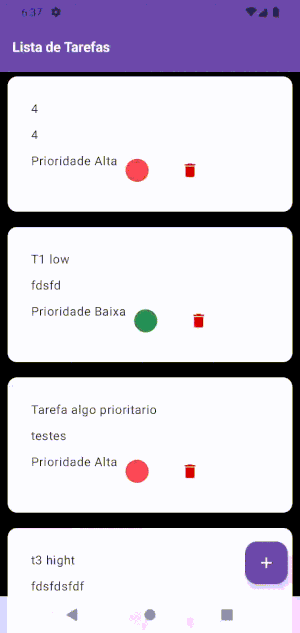

# android_task_list_jetpack_compose
android_task_list_jetpack_compose

Projeto Android usando o JetPack Compose
Banco de dados usando Google Firebase

O projeto é uma lista de tafera simples com a funcionalide de salvar, deletar e recupera tarefas no Firebase.
- Criar tarefa
- Deletar tarefa
- Listar tarefas

